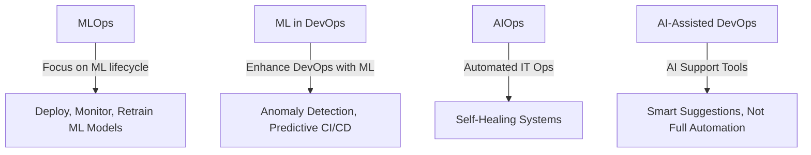

# 🔍 Understanding MLOps vs. ML in DevOps & AIOps vs. AI-Assisted DevOps

This guide breaks down the differences between commonly confused terms in the world of machine learning and AI integration in operations. It focuses on :

- MLOps vs. ML in DevOps
- AIOps vs. AI-Assisted DevOps

---

## 📦 MLOps vs. ML in Devops

| Feature             | **MLOps**                                                  | **ML in DevOps**                                           |
|---------------------|-------------------------------------------------------------|-------------------------------------------------------------|
| **Definition**      | Practices for deploying, managing, and monitoring ML models in production | Using ML techniques to enhance DevOps processes             |
| **Goal**            | Operationalize the entire ML lifecycle                      | Improve CI/CD and ops with ML capabilities                  |
| **Who Uses It**     | Data scientists, ML engineers, MLOps engineers              | DevOps teams integrating ML into toolchains                 |
| **Pipeline Focus**  | End-to-end ML workflows: data > training > deployment       | Automating ops like anomaly detection, auto-scaling         |
| **Tooling**         | MLFlow, Kubeflow, TFX, SageMaker, Vertex AI                 | Prometheus + ML, ELK + anomaly detection, CI/CD with ML     |
| **Example**         | Auto-retraining a fraud detection model weekly in prod      | Predicting failed deployments using historical CI/CD data   |

---

## 🤖 AIOps vs. AI-Assisted DevOps

| Feature             | **AIOps**                                                   | **AI-Assisted DevOps**                                     |
|---------------------|-------------------------------------------------------------|-------------------------------------------------------------|
| **Definition**      | AI/ML applied to automate and enhance IT operations         | Using AI tools to assist DevOps teams—not fully automate    |
| **Goal**            | Self-healing, real-time response to incidents               | Better decision-making, anomaly alerts                      |
| **Who Uses It**     | IT Ops, SREs, DevOps                                         | DevOps teams using AI as a helper tool                      |
| **Automation Level**| High (automated root cause, remediation, etc.)              | Medium (human-in-the-loop AI assistance)                   |
| **Tooling**         | Moogsoft, BigPanda, Dynatrace, Splunk AIOps                 | GitHub Copilot for CI/CD scripts, AI-powered runbooks       |
| **Example**         | AIOps system resolves a memory leak automatically           | AI tool suggests rollback on failed deploy, human confirms  |

---

## 🧠 Visual Summary



# 🤖 AI-Assisted DevOps

**AI-Assisted DevOps** enhances DevOps workflows using AI tools to help—not replace—engineers. It’s about smart suggestions, anomaly alerts, and decision support while keeping humans in the loop.

> Think: Copilot for DevOps tasks.

---

## 📘 What is AI-Assisted DevOps?

AI-Assisted DevOps leverages AI/ML models and tools to support, but not fully automate, DevOps tasks such as:

- Predicting build failures
- Suggesting remediation steps
- Prioritizing alerts
- Enhancing CI/CD with intelligent suggestions

Unlike **AIOps**, which aims for full automation, **AI-Assisted DevOps** focuses on **augmenting** human engineers.

---

## 🛠 Use Cases

| Use Case                          | AI Assistance Provided                            |
|----------------------------------|---------------------------------------------------|
| CI/CD Failure Prediction         | Predicts likely failure in a pipeline run         |
| Code Deployment Suggestions      | Copilot suggests optimized deployment scripts     |
| Log Analysis                     | GPT-based tools highlight anomalies in logs       |
| Alert Triage                     | AI prioritizes incidents based on impact          |
| Infra as Code (IaC) Suggestions | Recommends secure and optimized Terraform setups |

---

## 🧪 Example: Predicting CI/CD Failure with ML

### Step 1: Sample Dataset (ci_builds.csv)

```csv
build_time,tests_run,error_logs,build_passed
300,120,0,1
420,50,2,0
180,200,0,1
500,80,3,0

## Python code
```python
import pandas as pd
from sklearn.ensemble import RandomForestClassifier
from sklearn.model_selection import train_test_split

# Load dataset
df = pd.read_csv("ci_builds.csv")
X = df.drop("build_passed", axis=1)
y = df["build_passed"]

# Train/test split
X_train, X_test, y_train, y_test = train_test_split(X, y, test_size=0.2)

# Train model
clf = RandomForestClassifier()
clf.fit(X_train, y_train)

# Predict new build outcome
new_build = pd.DataFrame([[400, 100, 1]], columns=["build_time", "tests_run", "error_logs"])
prediction = clf.predict(new_build)
print("✅ Build Likely to Pass" if prediction[0] else "❌ Build Likely to Fail")

```
### Summary

Ai can provide accurate code for task such as shell scripting , writind docker file but when it comes to few programming task , it writes nthe code with outdates packages or invalid packages , therefore using AI
